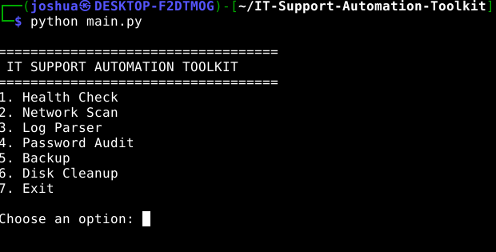
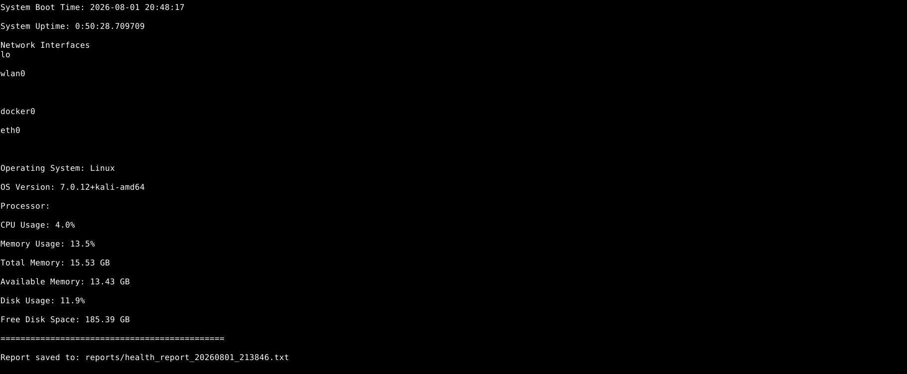
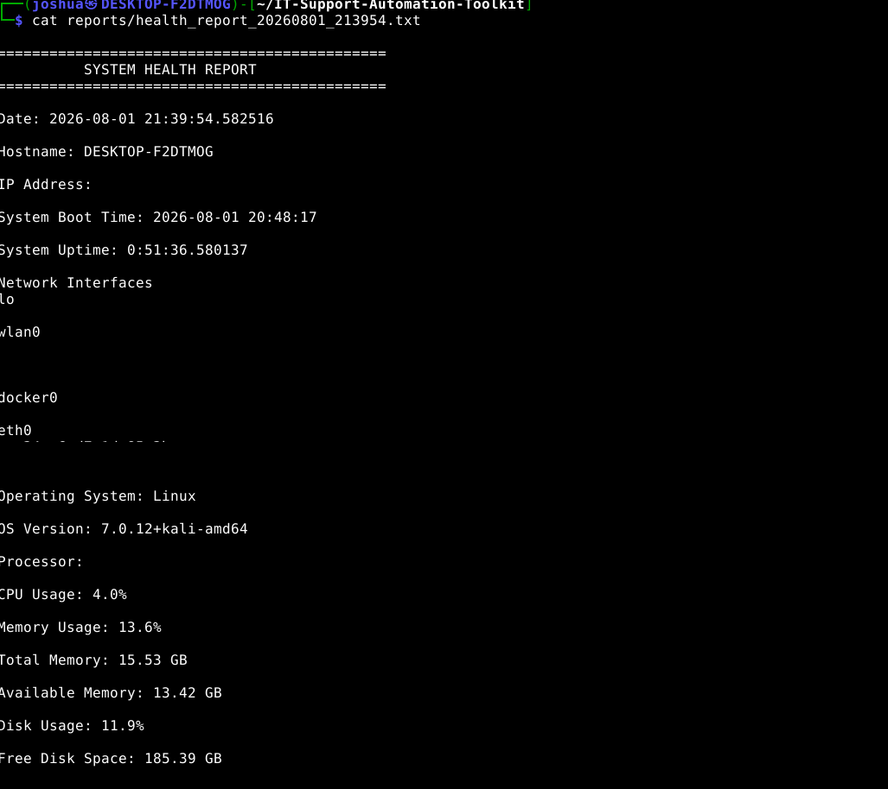

# IT Support Automation Toolkit

A Python-based IT troubleshooting and system diagnostics toolkit designed to automate common support tasks.

This project collects system health information, displays a detailed health report, and automatically generates timestamped reports for future reference. It is being developed as an expanding toolkit to strengthen Python programming, Linux administration, and IT automation skills while simulating utilities commonly used by IT Support professionals and System Administrators.

---

# Application Preview

## Main Menu

Launch the toolkit and select the desired troubleshooting module.



---

## System Health Report

The toolkit gathers real-time system information and displays a detailed health report in the terminal.



---

## Generated Report

Each health check automatically creates a timestamped report that can be reviewed later.



---

# Features

## Version 1.0

- Interactive menu-driven interface
- System health reporting
- CPU utilization monitoring
- Memory utilization monitoring
- Disk usage monitoring
- Operating system detection
- Hostname detection
- System boot time reporting
- System uptime reporting
- Network interface discovery
- Automatic timestamped report generation
- Report export to text files

---

# Technologies

- Python 3
- psutil
- socket
- platform
- datetime

---

# Installation

Clone the repository.

```bash
git clone https://github.com/jlangley3360/IT-Support-Automation-Toolkit.git
```

Move into the project directory.

```bash
cd IT-Support-Automation-Toolkit
```

Create a virtual environment.

```bash
python3 -m venv venv
```

Activate the virtual environment.

### Linux

```bash
source venv/bin/activate
```

### Windows

```powershell
venv\Scripts\activate
```

Install the required dependency.

```bash
pip install -r requirements.txt
```

Run the toolkit.

```bash
python main.py
```

---

# Example Workflow

1. Launch the toolkit.
2. Select **Health Check**.
3. The application gathers system information.
4. Results are displayed in the terminal.
5. A timestamped report is automatically saved in the **reports** directory.

---

# Current Health Report Includes

- Hostname
- IP Address
- Operating System
- OS Version
- CPU Usage
- Memory Usage
- Total Memory
- Available Memory
- Disk Usage
- Free Disk Space
- System Boot Time
- System Uptime
- Network Interface Discovery

---

# Project Roadmap

## Version 1.1

- Improved IP address detection
- Better network interface formatting
- Top memory-consuming processes
- Processor information improvements
- System restart recommendations based on uptime

## Version 1.2

- Network diagnostics
- Internet connectivity tests
- Gateway detection
- DNS resolution testing
- Open port detection

## Version 2.0

- Network scanner
- Log file parser
- Password strength auditor
- Backup automation
- Disk cleanup utility
- HTML report generation
- Service monitoring
- Colorized terminal output

---

# Skills Demonstrated

- Python Programming
- Linux Administration
- IT Automation
- System Diagnostics
- Modular Programming
- Report Generation
- File Handling
- Virtual Environments
- Python Libraries
- Troubleshooting

---

# Why I Built This

I wanted to build something more meaningful than standalone practice scripts.

This project is being developed as a practical IT support toolkit that grows over time with new functionality. It allows me to strengthen my Python programming skills while creating tools that reflect real-world IT troubleshooting and automation workflows.

---

# Author

**Joshua Langley**

Aspiring IT Support | SOC Analyst | Cybersecurity

**GitHub**

https://github.com/jlangley3360

**LinkedIn**

(Add your LinkedIn profile here)
